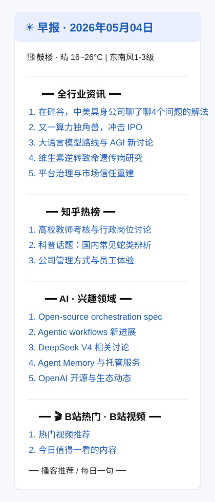
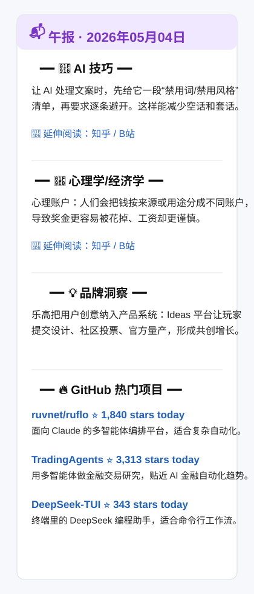

# Daily Briefing

一个面向个人的信息早报/午报自动推送系统。它会定时抓取 RSS、知乎热榜、全网热榜、B 站、天气、播客和 GitHub Trending，再用 LLM 做选稿、摘要或内容生成，最后通过飞书卡片推送给你。

项目当前以 GitHub Actions 运行为主，适合个人零服务器使用；也可以在本地或自己的服务器上手动运行。

## 功能概览

### 早报

早报会生成一张飞书卡片，包含：

- 全行业资讯：RSS + 知乎 + 全网热榜候选，经 GPT 选稿后展示 5 条。
- 知乎热榜：独立小板块，默认展示 3 条。
- AI 兴趣领域：AI RSS + 全网热点里的 AI 相关内容，经 GPT 选稿后展示 5 条。
- B 站热门：默认从 B 站热门视频里取 5 条。
- 天气：和风天气实时天气 + 预报。
- 播客推荐：Apple Podcasts 中国区热榜，覆盖科技、商务、教育、新闻分类。
- 每日一句：本地名言/梗句库随机抽取。

### 午报

午报会生成：

- AI 技巧
- 心理学/经济学知识卡片
- 品牌洞察
- GitHub Trending 热门项目 + GPT 中文摘要

### 当前内置信源

RSS：

- 36氪
- 虎嗅
- 少数派
- 极客公园
- IT之家
- 爱范儿
- 钛媒体
- InfoQ
- 澎湃新闻
- 界面新闻
- 纽约时报中文
- 量子位
- Hugging Face Blog
- OpenAI Blog

热榜：

- 知乎热榜
- 百度热搜
- 今日头条
- 微博
- 华尔街见闻
- 财联社热门
- 澎湃新闻

其他：

- B 站热门视频
- Apple Podcasts 热榜
- GitHub Trending
- 和风天气

## 效果预览

### 早报

<p>
  
</p>

### 午报

<p>
  
</p>

## 工作方式

```text
cron-job.org / manual dispatch
        |
        v
GitHub Actions
        |
        +--> src/morning.py
        |       +--> RSS / 知乎 / NewsNow 热榜 / B站 / 天气 / 播客
        |       +--> GPT 选稿
        |       +--> 飞书早报卡片
        |
        +--> src/afternoon.py
                +--> GPT 知识卡片
                +--> GitHub Trending + GPT 摘要
                +--> 飞书午报卡片
```

## 快速开始

### 1. Fork 仓库

Fork 本仓库到你的 GitHub 账号。

### 2. 配置 GitHub Actions Secrets

进入仓库：

`Settings -> Secrets and variables -> Actions -> New repository secret`

添加以下 Secrets：

| Secret | 必填 | 说明 |
| --- | --- | --- |
| `OPENAI_API_KEY` | 是 | OpenAI 或 OpenAI 兼容服务 API Key |
| `OPENAI_BASE_URL` | 是 | OpenAI 兼容接口地址，例如 `https://api.openai.com/v1` 或你的代理地址 |
| `FEISHU_APP_ID` | 是 | 飞书自建应用 App ID |
| `FEISHU_APP_SECRET` | 是 | 飞书自建应用 App Secret |
| `FEISHU_RECEIVE_ID` | 是 | 飞书接收者 ID，默认使用 `open_id` |
| `QWEATHER_API_KEY` | 是 | 和风天气 API Key |

本项目默认使用飞书自建应用私聊推送，不是群机器人 webhook。

### 3. 配置飞书应用

大致流程：

1. 在飞书开放平台创建企业自建应用。
2. 记录应用的 `App ID` 和 `App Secret`。
3. 给应用开通发送消息相关权限。
4. 发布/启用应用。
5. 获取你的 `open_id`，可使用 `tools/get_open_id.py` 辅助获取。
6. 将 `FEISHU_APP_ID`、`FEISHU_APP_SECRET`、`FEISHU_RECEIVE_ID` 写入 GitHub Secrets。

### 4. 配置和风天气

注册和风天气开发者账号，创建 API Key，然后把 key 写入 `QWEATHER_API_KEY`。

城市和天气 host 在 `config/config.yaml` 中配置：

```yaml
user:
  city: "鼓楼"
  city_adm: "南京"

weather:
  provider: "qweather"
  api_key: "${QWEATHER_API_KEY}"
  api_host: "your-qweather-host.example.com"
```

### 5. 修改个人偏好

复制示例配置：

```bash
cp config/config.example.yaml config/config.yaml
```

然后编辑 `config/config.yaml`。如果你想保留一份只在本地生效、不提交到 Git 的个人配置，可以创建 `config/config.local.yaml`；程序会优先读取它。

模块开关示例：

```yaml
modules:
  morning:
    general_news: true
    zhihu_hot: true
    interests: true
    hotlists: true
    bilibili: true
    weather: true
    quote: true
    podcast: true
  afternoon:
    ai_tip: true
    psychology: true
    brand_insight: true
    github_trending: true
```

把对应值改成 `false`，即可跳过该模块的抓取、生成和卡片展示。

兴趣关键词示例：

```yaml
interests:
  - name: "AI"
    keywords: ["人工智能", "大模型", "LLM", "AI Agent", "GPT", "OpenAI", "DeepSeek"]
    max_foreign: 2
    foreign_sources: ["Hugging Face Blog", "OpenAI Blog"]
    foreign_url_domains: ["huggingface.co", "openai.com"]
```

热榜源示例：

```yaml
hotlists:
  enabled: true
  api_url: "https://newsnow.busiyi.world/api/s"
  count_per_source: 10
  sources:
    - id: "baidu"
      name: "百度热搜"
    - id: "weibo"
      name: "微博"
    - id: "zhihu"
      name: "知乎"
```

知乎独立小板块：

```yaml
zhihu_hot:
  enabled: true
  count: 3
```

B 站：

```yaml
bilibili:
  name: "B站热门"
  mode: "popular"
  count: 5
```

### 6. 手动测试

在 GitHub Actions 页面手动触发：

- `Morning Briefing`
- `Afternoon Briefing`

也可以在本地运行：

```bash
pip install -r requirements.txt
cp .env.example .env
python src/morning.py
python src/afternoon.py
```

`.env` 示例：

```env
OPENAI_API_KEY=your-openai-api-key
OPENAI_BASE_URL=https://api.openai.com/v1
FEISHU_APP_ID=your-app-id
FEISHU_APP_SECRET=your-app-secret
FEISHU_RECEIVE_ID=your-open-id
QWEATHER_API_KEY=your-qweather-key
```

### 7. 定时触发

GitHub Actions 自带 cron 有时会延迟。当前推荐使用 cron-job.org 触发 GitHub `repository_dispatch`。

请求地址：

```text
POST https://api.github.com/repos/<owner>/<repo>/dispatches
```

Headers：

```text
Authorization: Bearer <GitHub PAT>
Accept: application/vnd.github.v3+json
Content-Type: application/json
```

早报 Body：

```json
{"event_type":"morning"}
```

午报 Body：

```json
{"event_type":"afternoon"}
```

GitHub PAT 建议使用 Fine-grained token，并只授予该仓库所需权限。

## 项目结构

```text
daily-briefing/
├── .github/workflows/
│   ├── morning.yml
│   └── afternoon.yml
├── config/
│   ├── config.example.yaml
│   ├── config.yaml
│   ├── rss_sources.yaml
│   └── quotes.json
├── src/
│   ├── morning.py
│   ├── afternoon.py
│   ├── fetchers/
│   │   ├── rss_fetcher.py
│   │   ├── zhihu_fetcher.py
│   │   ├── hotlist_fetcher.py
│   │   ├── bilibili_fetcher.py
│   │   ├── weather_fetcher.py
│   │   ├── podcast_fetcher.py
│   │   └── github_fetcher.py
│   ├── processors/
│   │   ├── llm_selector.py
│   │   └── llm_generator.py
│   ├── publishers/
│   │   └── feishu.py
│   └── utils/
│       ├── llm_client.py
│       ├── dedup.py
│       ├── web_searcher.py
│       └── logger.py
├── data/
├── tools/
├── requirements.txt
└── README.md
```

## 关键设计说明

### 为什么用飞书应用模式

飞书应用消息支持私聊推送和交互式卡片，更适合个人日报。群机器人 webhook 更容易配置，但功能和私聊能力有限。

### 为什么用 cron-job.org

GitHub Actions cron 在免费环境中可能延迟。外部 cron 通过 `repository_dispatch` 触发，时间更可控。

### TrendRadar / NewsNow 说明

项目中的全网热榜适配器使用 NewsNow 风格接口抓取热榜数据。没有复制 TrendRadar 的 GPL 代码，只保留轻量 API 适配逻辑。

### 数据去重

已推送文章会记录在 `data/seen_articles.json`，默认保留 7 天。播客推荐历史会记录在 `data/podcast_history.json`。

`data/*.json` 属于运行时数据，默认不会提交到 Git。仓库只保留 `data/.gitkeep` 用来保留目录。

## 本地开发

```bash
pip install -r requirements.txt
python -m py_compile src/morning.py src/afternoon.py
python -m unittest discover -s tests
```

单独测试部分模块：

```bash
python -c "from src.fetchers.zhihu_fetcher import fetch_zhihu_hot; print(fetch_zhihu_hot()[:3])"
python -c "from src.fetchers.podcast_fetcher import fetch_podcast; print(fetch_podcast())"
python -c "from src.fetchers.github_fetcher import fetch_trending_repos; print(fetch_trending_repos())"
```

## 后续计划

- 增加更多推送渠道：企业微信、Telegram、邮件。
- 增加 Docker / docker-compose 支持。
- 增加单元测试。
- 清理运行数据和开源模板。

## License

MIT
